# FREING
  
Zápočtový projekt týmu Endor předmětu MOIS ZS AR 2025/26

## Členové týmu
- j.zlesak (Team leader)
- j.staša (Configuration manager)
- j.fogl (BackEnd develeper)
- a.zamastil (FrontEnd developer)

## Členění projektu
`FREING` - Kořenový adresář projektu  
├── `backend` - Zdrojové kódy backendu  
├── `diagrams` - Diagramy  
├── `docs` - Dokumentace  
├── `freing_docker` - Soubory pro Docker a Docker Compose   
├── `frontend` - Zdrojové kódy frontendu  
└── `screenshots` - Snímky obrazovky aplikace  

### Pohledy na aplikaci

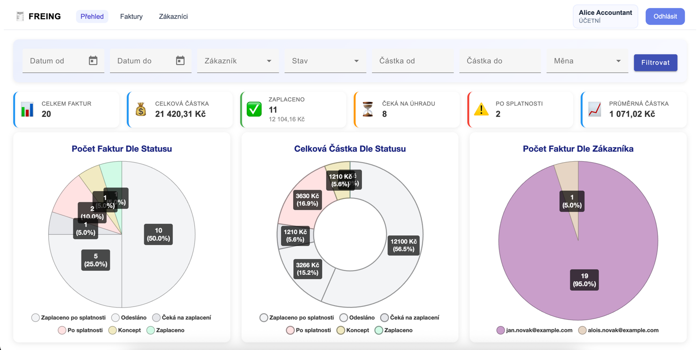  
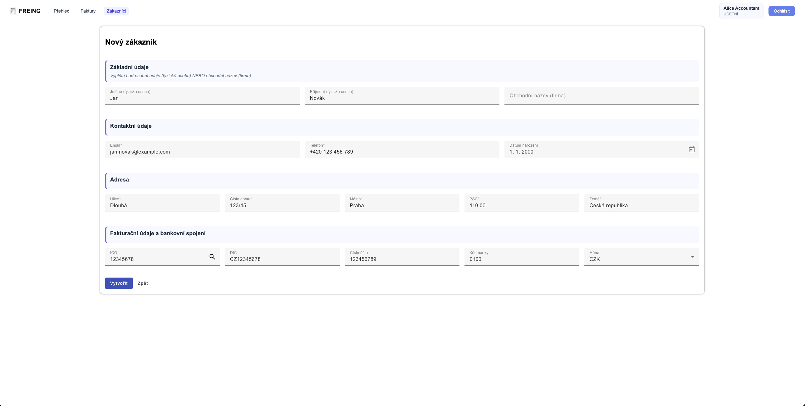  
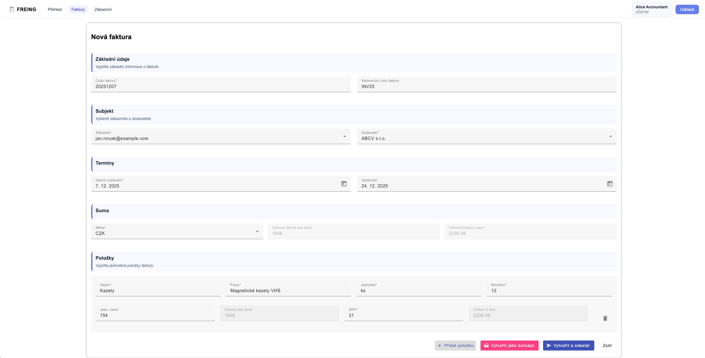  
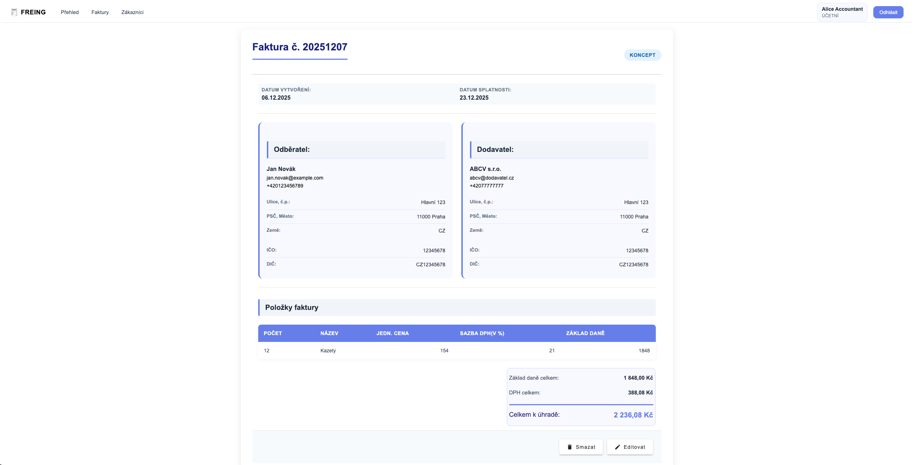  
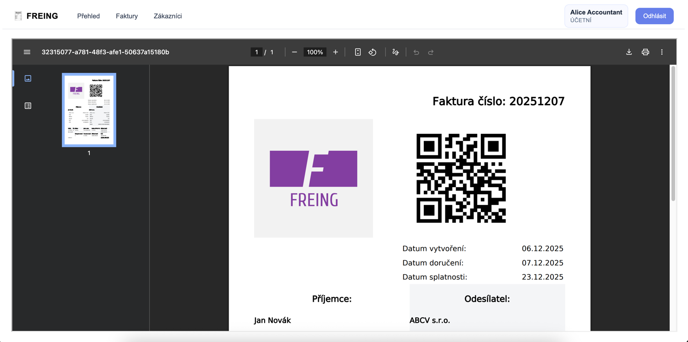  
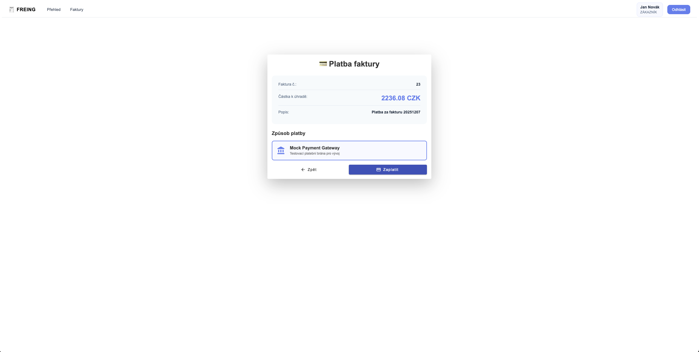  
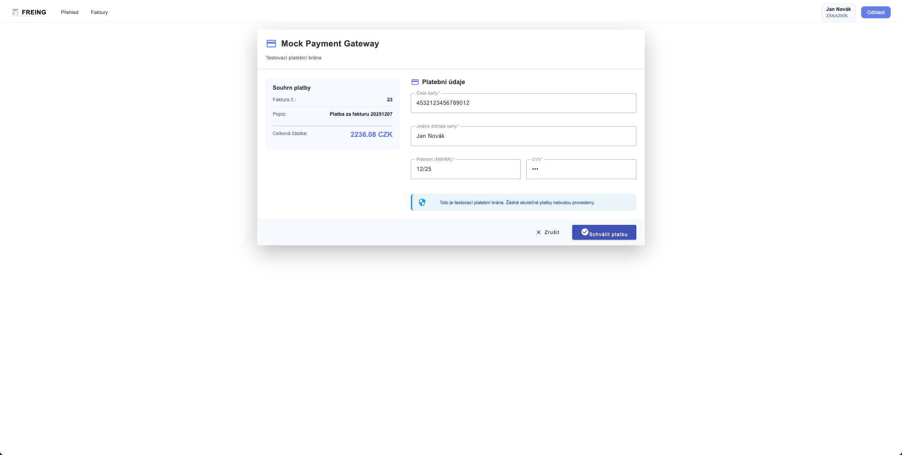  
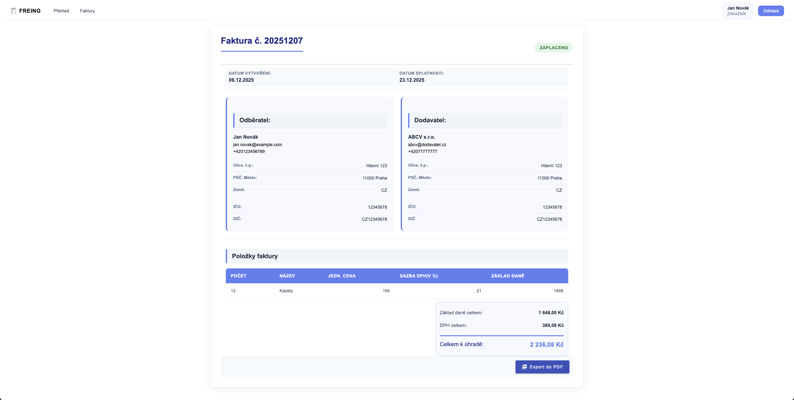  

### Základní diagramy

#### Use case diagram

#### Big picture

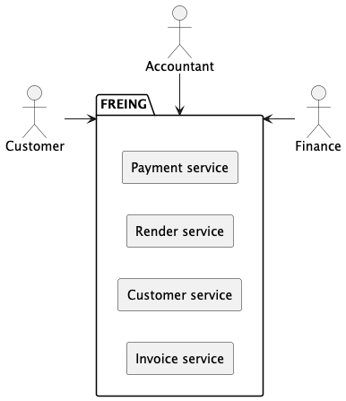

#### Business context

#### Technologie využité v projektu

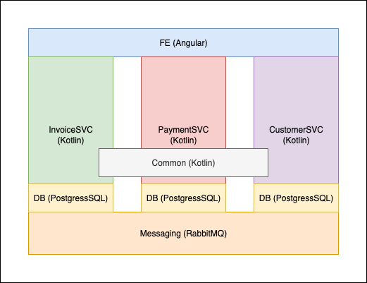

#### Infrastruktura projektu

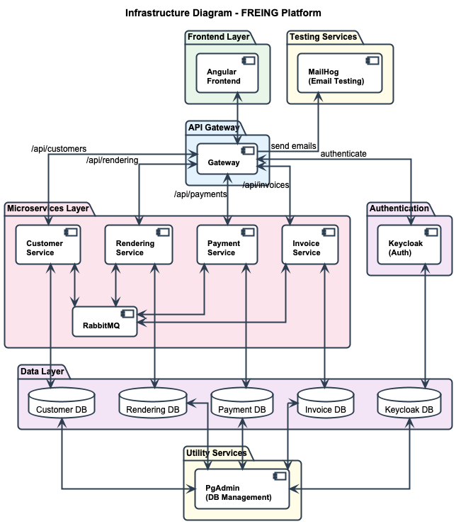

### Diagram stavů faktur

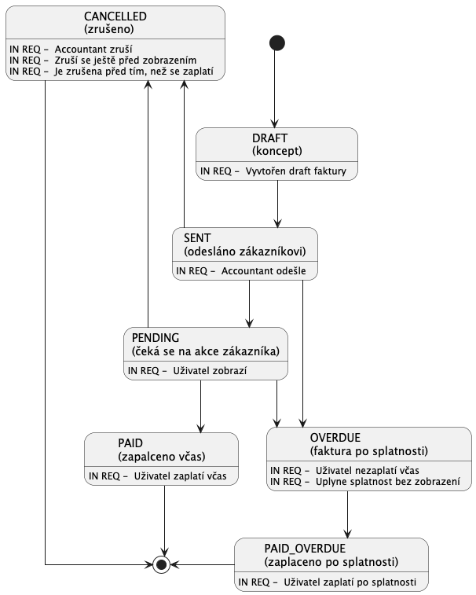