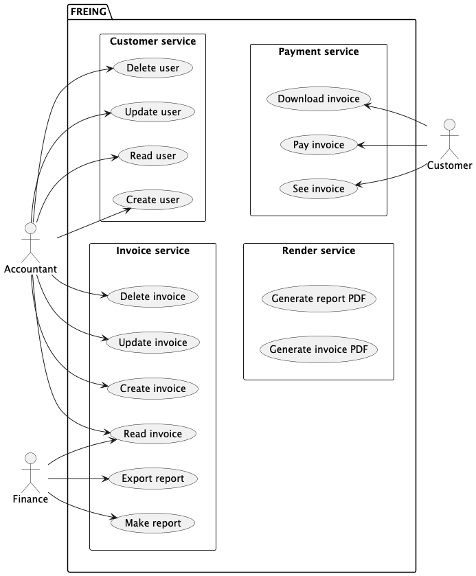

# Software Architecture Document  

## FREING  
### French E-invoicing system  

team: Endor  
členové:  
j.zlesak (TL),  
j.staša (Configuration manager),  
t.fogl (BackEnd develeper),  
a.zamastil (FrontEnd developer)  

datum: 2024-06-10  
verze: 1.0

# Obsah
1. [Úvod a cíle](#1-úvod-a-cíle)  
2. [Omezení systému](#2-omezení-systému)  
3. [Kontext](#3-kontext)  
4. [Strategie řešení](#4-strategie-řešení)  
5. [Zobrazení stavebních bloků](#5-zobrazení-stavebních-bloků)  
6. [Zobrazení běhů](#6-zobrazení-běhů)  
7. [Zobrazení nasazení](#7-zobrazení-nasazení)  
8. [Technologické a implementační koncepty](#8-technologické-a-implementační-koncepty)  
9. [Architektonická rozhodnutí](#9-architektonická-rozhodnutí)  
10. [Kvalitativní požadavky](#10-kvalitativní-požadavky)  
11. [Rizika a jejich zmírňování](#11-rizika-a-jejich-zmírňování)  
12. [Glosář](#12-glosář)

## 1. Úvod a cíle
Tato sekce se zaměří na účel dokumentu, cílovou skupinu a cíle systému.
### 1.1 Účel dokumentu
Tento dokument popisuje softwarovou architekturu systému FREING, který je určen pro elektronickou fakturaci.
Dále popíše architekturu systému FREING, funkcionality, které systém poskytuje.
Stejně tak dokument poopíše architekturu systému, jeho komponenty a jejich interakce.

### 1.2 Cílová skupina
Dokument je určen pro vývojový tým a další zainteresované strany, především pak pro potencionální investory (cvičící předmětu MOIS).

### 1.3 Cíle systému
Systém FREING je navržen tak, aby umožnil elektronickou fakturaci, která se od následujíchí roku (2026) stane povinnou pro všechny firmy ve Francii. 
Systém bude zajišťovat bezpečné a efektivní zpracování faktur mezi firmami nebo firmou a jedincem.

## 2. Omezení systému
Tato sekce popisuje technologická a organizační omezení systému. Tato omezení mohou zahrnovat požadavky na výkon, bezpečnost, škálovatelnost a další faktory, které ovlivňují návrh a implementaci systému.
### 2.1 Technologická omezení
- Systém musí podporovat více uživatelských rolí s různými úrovněmi přístupu
- Systém musí být bezpečný a chránit citlivé údaje
- Systém musí být uživatelsky přívětivý
- Systém musí být škálovatelný

### 2.2 Organizační omezení
- Systém musí být vytvořen v termínu od 1.10.2025 do 9.12.2025
- Na systtému se podílí tým 4 lidí, složen z jednoho team leada, jednoho configuration managera, jednoho backend developera a jednoho frontend developera
- Systém musí být vytvořen s využitím technologií: Kotlin, Angular, PostgreSQL, Docker, Keycloak

## 3. Kontext
Tato sekce popisuje kontext systému, včetně jeho interakcí s externími systémy a uživateli.

### 3.1 Byznysový model systému
Systém FREING je navržen tak, aby umožnil elektronickou fakturaci, která se v následujících letech (již od 2026) postupně stane povinnou pro všechny státy v Evropsské unii, v čele s Francií a Belgií.
Systém FREING bude poskytovat platformu pro elektronickou fakturaci mezi firmami nebo mezi firmou a jednotlivcem.
Hlavními aktéry jsou firmy, které budou vytvářet a odesílat faktury, a koncoví zákazníci, kteří budou faktury přijímat. 
Systém bude také poskytovat funkce pro správu zákazníků, sledování stavu faktur a generování reportů.  

Systém FREING bude komunikovat s externími systémy, jako jsou bankovní systémy pro zpracování plateb, registry ekonomických subjektů pro ověřování firem nebo kurzovními systémy pro převod měn.

### 3.2 Use Case diagram
Use Case diagram zobrazuje hlavní funkce systému a interakce mezi uživateli a systémem.    
  
Role
- Účetní (Accounting)
- Manager (Manager)
- Koncový zákazník (Customer) (Firma nebo jedinec)

## 4. Strategie řešení
Tato sekce popisuje strategii řešení, která bude použita k dosažení cílů systému. Strategie bude zahrnovat architektonické vzory, technologie a nástroje, které budou použity k vývoji systému.
### 4.1 Struiktura systému
- Frontend: Angular
- Backend: Kotlin, Spring Boot
- Databáze: PostgreSQL
- Autentizace a autorizace: Keycloak
- Kontejnerizace: Docker

### 4.2 Architektonické vzory
- Microservices
- RESTful API
- Messagging
- MVC (Model-View-Controller)

### 4.3 Nástroje
- IDE: IntelliJ IDEA, Visual Studio Code
- Verzovací systém Git s uložištěm na platformě GitHub
- Swagger pro dokumentaci API generované dle anotací jednotlivých přistupových bodů
- PlantUML pro strojově zapisovatelné diagramy
- Postman pro testování API
- Docker pro kontejnerizaci a nasazení

### 4.4 Technologie
- Kotlin pro backend vývoj
- Angular pro frontend vývoj
- PostgreSQL pro databáze
- Docker pro kontejnerizaci
- Keycloak pro správu identit a přístupů
- REST pro komunikaci mezi službami
- OpenAPI pro dokumentaci API
- Nginx jako reverzní proxy server
- RabbitMQ pro mezislužební komunikaci
- MailHog pro zachytávání a testování e-mailů během vývoje
- PgAdmin pro správu PostgreSQL databází

## 5. Zobrazení stavebních bloků
Tato sekce popisuje a dekomponuje hlavní stavební bloky systému. Každý blok je popsán z hlediska jeho odpovědností, rozhraní a interakcí s ostatními bloky.

### 5.1 Frontend
- Odpovědnosti: Uživatelské rozhraní, interakce s uživatelem, volání API
- Rozhraní: REST API
- Interakce: Komunikace s backendem přes REST API
- Technologie: Angular, HTML, CSS, TypeScript
- Nástroje: Visual Studio Code, Angular CLI
### 5.2 Backend
- Odpovědnosti: Zpracování obchodní logiky, správa dat, komunikace s databází
- Rozhraní: REST API
- Interakce: Komunikace s frontendem přes REST API, komunikace s databází
- Technologie: Kotlin, Spring Boot
- Nástroje: IntelliJ IDEA, Spring Boot CLI
### 5.3 Databáze
- Odpovědnosti: Ukládání a správa dat
- Rozhraní: SQL
- Interakce: Komunikace s backendem přes JDBC
- Technologie: PostgreSQL
### 5.4 Autentizace a autorizace
- Odpovědnosti: Správa uživatelských identit a přístupů
- Rozhraní: REST API
- Interakce: Komunikace s backendem přes REST API
- Technologie: Keycloak
### 5.5 Kontejnerizace a nasazení
- Odpovědnosti: Kontejnerizace aplikace, nasazení a správa kontejnerů
- Rozhraní: Docker CLI
- Interakce: Správa kontejnerů pomocí Dockeru
- Technologie: Docker
- Nástroje: Docker CLI, Docker Compose, Shell skripty

## 6. Zobrazení běhů
Tato sekce oproti sekci 5 popisuje dynamické chování systému. Popisuje, jak se stavební bloky chovají během různých scénářů použití.
### 6.1 Scénář: Vytvoření a odeslání faktury
1. Uživatelský vstup (Účetní): Uživatel vyplní formulář pro vytvoření faktury ve webovém rozhraní.
2. Frontend: Odeslá data faktury na backend přes REST API.
3. Backend: Přijme data faktury, zvaliduje je a uloží do databáze.
4. Backend: Odeslá fakturu příjemci (jiné firmě nebo státní instituci).
5. Backend: Vrátí potvrzení o úspěšném odeslání faktury frontendu.
6. Frontend: Zobrazí potvrzení uživateli.
### 6.2 Scénář: Sledování stavu faktury
1. Uživatelský vstup (Manažer, Účetní): Uživatel požádá o zobrazení stavu faktury ve webovém rozhraní.
2. Frontend: Pošle požadavek na backend přes REST API.
3. Backend: Přijme požadavek, načte stav faktury z databáze a vrátí ho frontendu.
4. Frontend: Zobrazí stav faktury uživateli.
### 6.3 Scénář: Placení faktury
1. Uživatelský vstup (Zákazník): Uživatel zvolí možnost platby faktury ve webovém rozhraní.
2. Frontend: Odeslá požadavek na backend přes REST API.
3. Backend: Přijme požadavek, zpracuje platbu a aktualizuje stav faktury v databázi.
4. Backend: Vrátí potvrzení o úspěšné platbě frontendu.
5. Frontend: Zobrazí potvrzení uživateli.
### 6.4 Scénář: Autentizace uživatele
1. Uživatelský vstup (Všichni uživatelé): Uživatel zadá své přihlašovací údaje ve webovém rozhraní.
2. Frontend: Odeslá přihlašovací údaje na Keycloak server.
3. Keycloak: Ověří přihlašovací údaje a vrátí autentizační token frontendu.
4. Frontend: Uloží autentizační token a použije ho pro další požadavky na backend.
5. Backend: Ověří autentizační token při každém požadavku a povolí nebo zamítne přístup na základě uživatelských rolí.
### 6.5 Scénář: Vytvoření zákazníka
1. Uživatelský vstup (Účetní): Uživatel vyplní formulář pro vytvoření nového zákazníka ve webovém rozhraní.
2. Frontend: Odeslá data zákazníka na backend přes REST API.
3. Backend: Přijme data zákazníka, zvaliduje je a uloží do databáze.

## 7. Zobrazení nasazení
Tato sekce popisuje fyzické nasazení systému, včetně hardwarových a softwarových komponent, které tvoří systém.
### 7.1 Fyzické nasazení
- Servery: Aplikace bude nasazena na cloudových serverech (např. AWS, Azure)
- Databáze: PostgreSQL bude nasazena na samostatném serveru nebo jako spravovaná služba (např. Amazon RDS)
- Kontejnerizace: Aplikace bude kontejnerizována pomocí Dockeru a nasazena pomocí Docker Compose nebo Kubernetes
### 7.2 Softwarové komponenty
- Operační systém: Linux (např. Ubuntu)
- Webový server: Nginx frontend aplikace
- Aplikační server: Spring Boot pro backend aplikaci

## 8. Technologické a implementační koncepty
Tato sekce popisuje klíčové technologické a implementační koncepty, které budou použity při vývoji systému.
### 8.1 RESTful API
- REST (Representational State Transfer) je architektonický styl pro návrh síťových aplikací. RESTful API umožňuje komunikaci mezi klientem a serverem pomocí standardních HTTP metod (GET, POST, PUT, DELETE).
### 8.2 Microservices
- Microservices je architektonický vzor, který rozděluje aplikaci na menší, nezávislé služby. Každá služba je zodpovědná za konkrétní funkčnost a komunikuje s ostatními službami přes API.
### 8.3 MVC (Model-View-Controller)
- MVC je architektonický vzor, který odděluje data (Model), uživatelské rozhraní (View) a obchodní logiku (Controller). Tento vzor usnadňuje správu a údržbu kódu.
### 8.4 Kontejnerizace
- Kontejnerizace je technologie, která umožňuje balení aplikací a jejich závislostí do izolovaných kontejnerů. Docker je populární nástroj pro kontejnerizaci, který usnadňuje vývoj, testování a nasazení aplikací.
### 8.5 Keycloak
- Keycloak je open-source řešení pro správu identit a přístupů. Poskytuje funkce jako autentizace, autorizace, správa uživatelů a integrace s různými aplikacemi a službami.

## 9. Architektonická rozhodnutí
Tato sekce dokumentuje klíčová architektonická rozhodnutí, která byla učiněna během návrhu systému. Každé rozhodnutí by mělo obsahovat popis problému, možnosti řešení, zvolené řešení a jeho důvody.
### 9.1 Volba technologie pro backend
- Problém: Výběr vhodné technologie pro vývoj backendu
- Možnosti: Java, Kotlin, Node.js, Python
- Zvolené řešení: Kotlin se Spring Boot
- Důvody: Kotlin nabízí moderní syntaxi, interoperabilitu s Javou a je dobře podporován v ekosystému Spring. Spring Boot usnadňuje rychlý vývoj a nasazení mikroservis.
### 9.2 Volba technologie pro frontend
- Problém: Výběr vhodné technologie pro vývoj frontendu
- Možnosti: React, Angular, Vue.js
- Zvolené řešení: Angular
- Důvody: Angular poskytuje robustní rámec pro vývoj komplexních webových aplikací, má silnou komunitu a je dobře podporován pro podnikové aplikace.
### 9.3 Volba databáze
- Problém: Výběr vhodné databáze pro ukládání faktur
- Možnosti: MySQL, PostgreSQL, MongoDB
- Zvolené řešení: PostgreSQL
- Důvody: PostgreSQL je výkonná relační databáze s pokročilými funkcemi, jako je podpora JSON, což je užitečné pro flexibilní ukládání dat. Má také silnou komunitu a je dobře podporována v cloudových prostředích.
### 9.4 Volba autentizačního a autorizačního systému
- Problém: Výběr vhodného řešení pro správu uživatelskských identit a přístupů
- Možnosti: OAuth2, JWT, Keycloak
- Zvolené řešení: Keycloak
- Důvody: Keycloak poskytuje komplexní řešení pro správu identit a přístupů, podporuje různé autentizační protokoly a je snadno integrovatelný s aplikacemi.
### 9.5 Volba kontejnerizace a nasazení
- Problém: Výběr vhodného nástroje pro kontejnerizaci a nasazení aplikace
- Možnosti: Docker, Kubernetes, Docker Compose
- Zvolené řešení: Docker pro kontejnerizaci, Docker Compose pro jednoduché nasazení
- Důvody: Docker umožňuje snadnou kontejnerizaci aplikací, což usnadňuje vývoj, testování a nasazení. Docker Compose umožňuje jednoduché definování a spuštění více kontejnerů, což je vhodné pro menší projekty.

## 10. Rizika a jejich zmírňování
Tato sekce identifikuje potenciální rizika spojená s architekturou systému a navrhuje strategie pro jejich zmírnění.
### 10.1 Rizika
- Bezpečnostní rizika: Únik citlivých dat, neoprávněný přístup
- Výkonová rizika: Nedostatečný výkon při vysokém zatížení
- Rizika škálovatelnosti: Neschopnost systému růst s rostoucím počtem uživatelů
### 10.2 Strategie zmírňování rizik
- Bezpečnostní opatření: Implementace autentizačních a autorizačních mechanismů
- Výkonová optimalizace: Optimalizace kódu, použití caching, load balancing
- Škálovatelnost: Návrh systému s ohledem na horizontální škálování, použití cloudových služeb

## 11. Glosář
- REST API: Representational State Transfer Application Programming Interface
- MVC: Model-View-Controller
- SQL: Structured Query Language
- JDBC: Java Database Connectivity
- IDE: Integrated Development Environment
- CLI: Command Line Interface
